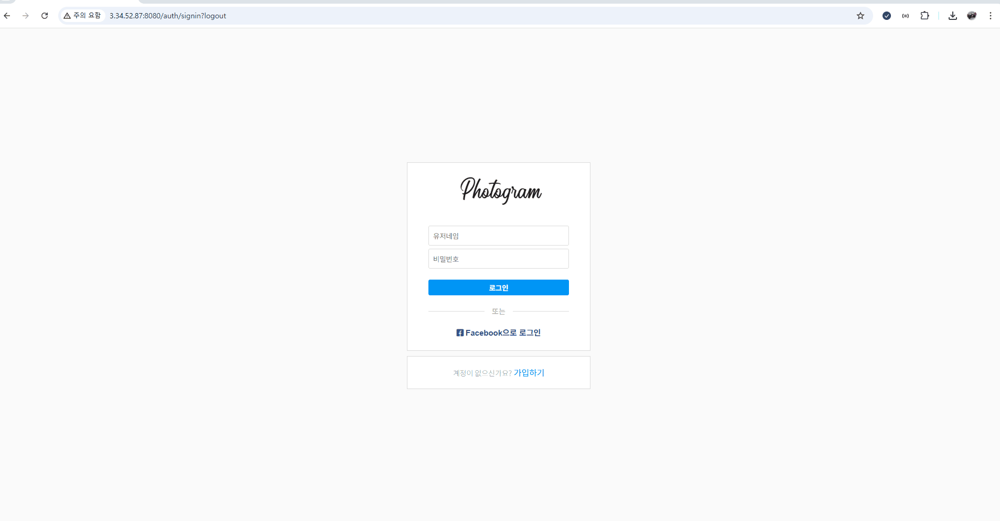
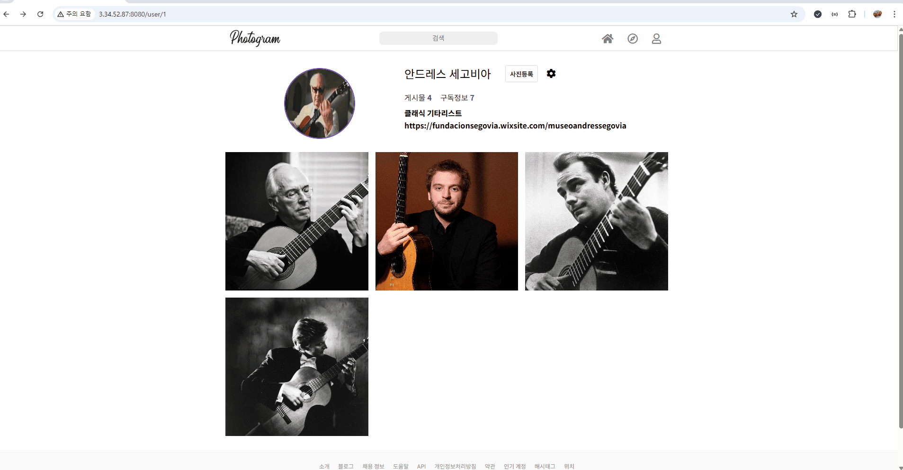

# Photogram

Instagram 스타일의 SNS 웹 서비스  
Spring Boot 기반 서버 렌더링 + AWS 인프라 환경에서 운영되는 개인 프로젝트

---

## 📌 프로젝트 개요

Photogram은 SNS 서비스의 핵심 기능을 직접 구현하고,  
인증 · 이미지 업로드 · 소셜 관계 · 성능 최적화 · 배포 및 운영까지  
웹 서비스 전반의 흐름을 경험하기 위해 진행한 개인 프로젝트입니다.

---

## 🛠 기술 스택

### Backend
- Java 17
- Spring Boot
- Spring Security (Form Login, OAuth2)
- JPA / Hibernate
- MariaDB

### Infrastructure
- AWS EC2 (t3.micro)
- AWS RDS (MariaDB)
- AWS S3
- Redis
- Docker
- Nginx

### CI/CD
- GitHub Actions

---

## 🏗 시스템 아키텍처

- Nginx를 통한 Reverse Proxy 및 Load Balancing
- Docker 기반 WAS 컨테이너 2대(Tomcat + WAR) 운영
- Redis를 세션 스토리지 및 캐시로 활용하여 WAS 무상태 구조 구성
- 이미지 파일은 S3, 메타데이터는 RDS에 저장

---

## 🗂 ERD

- User / Image / Comment / Likes / Subscribe 엔티티 구성
- SNS 서비스 특성을 고려한 관계 중심 설계

---

## ✨ 주요 기능

### 인증
- 회원가입 / 로그인
- Facebook OAuth2 로그인

### 게시물
- 이미지 업로드 (AWS S3)
- 게시물 피드 조회
- 인기 게시물 페이지 조회

### 소셜
- 유저 검색
- 구독 / 구독 취소
- 좋아요 / 댓글

### 프로필
- 프로필 사진 변경
- 회원정보 수정

---

## 🎬 기능 시연

### 🔐 로그인 / 인기 페이지 / 프로필 페이지

### 🔍 유저 검색 / 구독

### ❤️ 좋아요 / 💬 댓글

### 🖼 프로필 사진 변경 / 게시물 등록

### ⚙️ 회원정보 변경

---

## 🚀 배포 및 운영 경험 (CI/CD)

- GitHub Actions 기반 CI/CD 파이프라인 구축
  - master 브랜치 push 시 자동 배포
- Maven 빌드 → Docker 이미지 빌드/푸시(Docker Hub) → EC2 SSH 접속 후 배포
- WAS 2대(8080/8081)를 순차적으로 교체하여 다운타임 최소화
- t3.micro 환경을 고려해 컨테이너 기동 안정화 대기 시간 적용
- docker image prune을 통한 디스크 사용량 관리

---

## 🤔 트러블 슈팅 & 성능 최적화

### 1. 저사양 인프라(t3.micro) 운영 안정성 확보
- EC2 t3.micro(1GB RAM) 환경에서 WAS 2대 확장을 위해 JVM Heap 메모리를 컨테이너당 256MB로 제한
- Swap Memory(2GB) 설정 및 Redis를 별도 인스턴스로 분리하여 메모리 부하 분산
- 결과적으로 nginx 포함 구성에서도 인스턴스 중단 없이 안정적인 운영 가능

### 2. Redis 캐싱 도입 과정에서의 직렬화 이슈 해결
- 엔티티 및 PageImpl을 그대로 캐싱하면서 발생한 직렬화·역직렬화 문제 발생
- 렌더링에 필요한 필드만 포함한 커스텀 DTO와 전용 페이징 DTO로 구조 개선
- Redis 캐시 데이터의 안정적인 직렬화/역직렬화 환경 구축

### 3. 게시물 조회 API 성능 개선
- N + 1 문제 및 인덱스 부재로 인한 조회 성능 저하 확인
- Fetch Join, Batch Size 설정, 인덱스 적용 및 Redis 캐싱을 통해 성능 개선
- 평균 응답 시간 342ms → 24ms, 처리량 약 3.5배 향상

